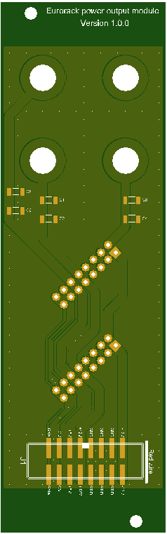

This directory contains pictures of the PCB exported from the [pcbs.io](https://pcbs.io) and [JLCPCB](https://jlcpcb.com) services.

These pictures are based off the Gerber files in the [Upverter exports](../Upverter%20exports/) directory.

<table cellspacing="0" cellpadding="0" border="0" width="100%">
  <tr>
    <th>Service</th>
    <th>Top</th>
    <th>Bottom</th>
  </tr>
  <tr>
    <td>PCBs.io</td>
    <td></td>
    <td></td>
  </tr>
  <tr>
    <td>JLCPCB</td>
    <td></td>
    <td></td>
  </tr>
</table>
